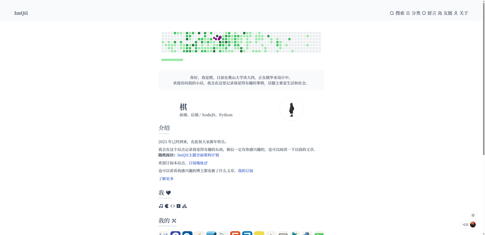

# NewImQi1 主题

从2024年10月25日为 https://imqi1.com 服役至今的主题，需配套ImQi1插件使用。

此主题仅开源，二开无需授权，但需标注出处。

博主Typecho版本为1.2.1，php版本为8.2，未测试其他版本兼容性。

## 功能

- 基本 Markdown 样式
- 为图片分类设计的额外样式
- 独立的首页、关于页面
- 额外的正文样式类型，如视频、音乐、轮播图
- 胶囊音乐，右键菜单，亮暗切换，PWA，评论区归属地显示

请到 https://imqi1.com 查看Demo。

主题刚开源，恕没有时间制作使用教程，请自行研究。
